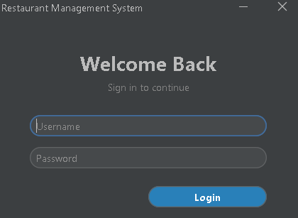
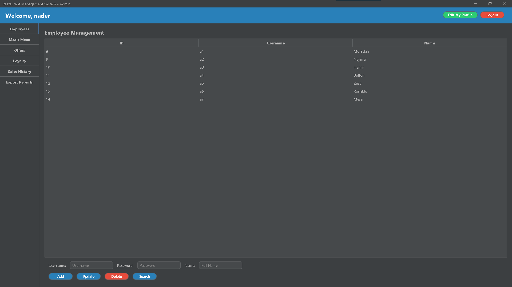
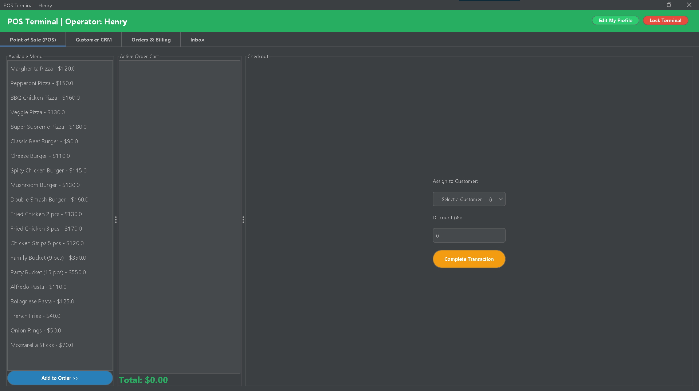
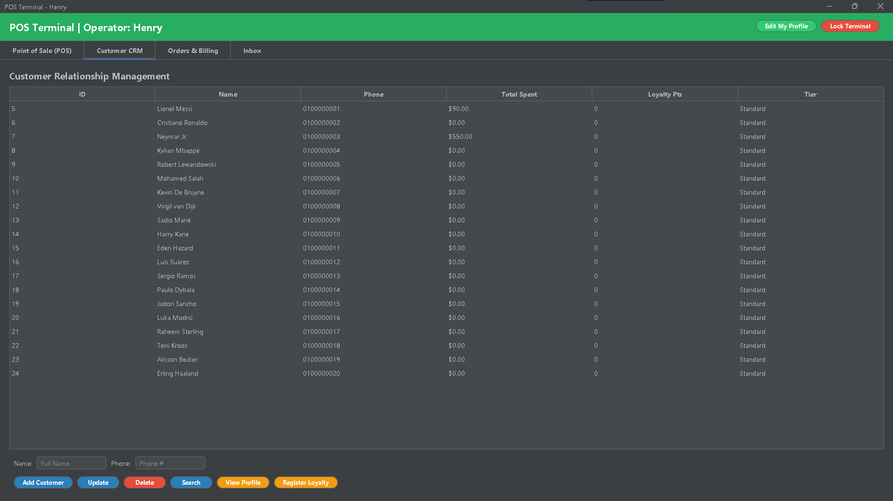

# Restaurant Management System

## Overview
This is a Java-based restaurant management system with a modern GUI and SQLite database.

---

## Screenshots

### Login

### Admin Dashboard

### POS System

### Customer CRM

---

## Features
- Admin dashboard
- Employee POS system
- Customer management
- Orders management
- SQLite database

---

## How to Run
Run:
compile_and_run.bat

---

## Default Login
Username: nader1  
Password: 11  

---

## Author
Nader Mostafa
